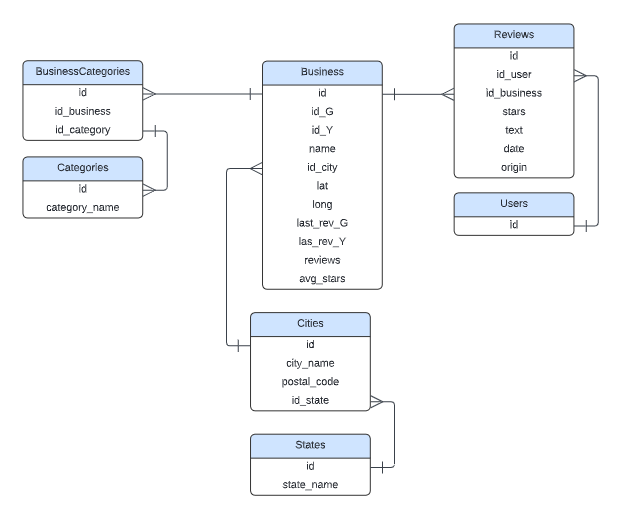
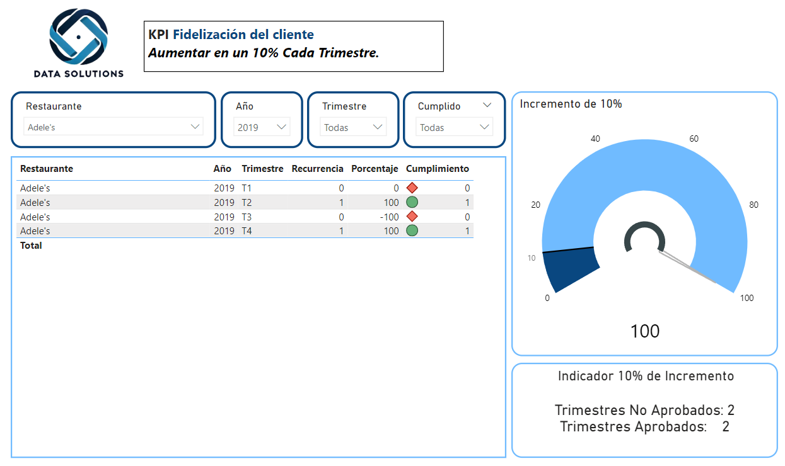
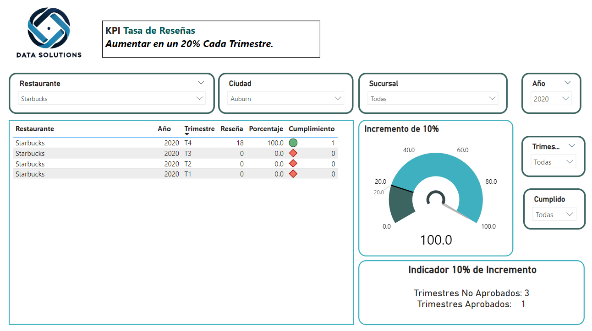
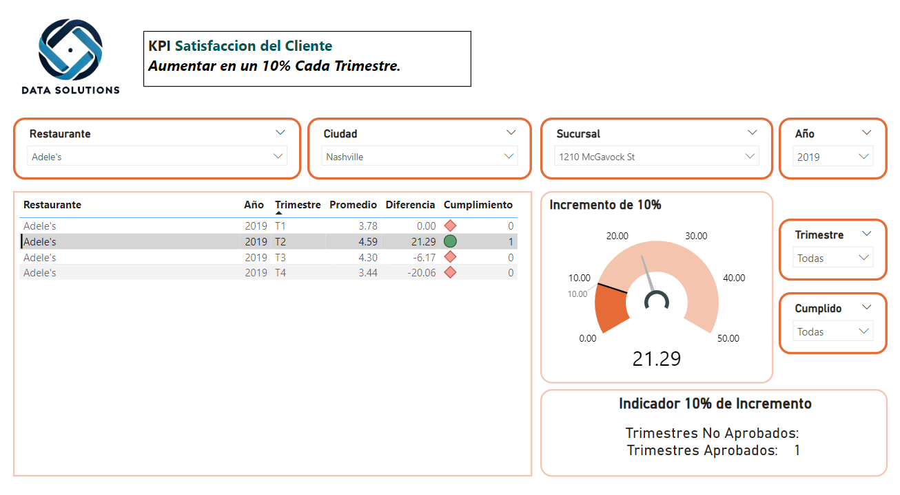

# PROYECTO GRUPAL 

## `Data Solutions`

  

## Roles y miembros del equipo
* Data engineer: Alberto - Franky
* Machine learning engineer: Carla - Josue
* Data analyst: Jovany
* Cloud engineer: Jesús

## Introducción
El presente proyecto se centra en el análisis y la creación de sistemas de recomendación basados en reseñas de usuarios de plataformas populares como Google Maps y Yelp. El objetivo principal es desarrollar herramientas que ayuden a un conglomerado de empresas a comprender mejor la percepción de sus clientes y a tomar decisiones informadas. Para este proyecto, hemos creado una empresa ficticia llamada Data Solutions, que se encargará de implementar soluciones de ciencia de datos para invertir con éxito.

## Entendimiento de la situación actual
Se describe la situación actual comunicando el contexto, la problemática y expresando posibles soluciones.

### Contexto
Desde hace muchos años, tanto Yelp como Google Maps permiten a los usuarios escribir reseñas sobre sus experiencias en una variedad de negocios, principalmente en el sector comercial. Estas plataformas han ido ganando aceptación y popularidad a medida que las opiniones de los usuarios han crecido y tomado protagonismo, ayudando a otros usuarios a tomar decisiones más informadas. Como consecuencia, estas reseñas se han convertido en un recurso valioso para las empresas, permitiéndoles entender la percepción de los clientes sobre sus servicios, medir su desempeño, identificar áreas de mejora y planificar estrategias de negocio más efectivas.

### Problemática
A continuación se detallan los distintos desafíos encontrados:
1. Conocimiento del cliente: Las empresas necesitan conocer la imagen que los usuarios tienen de ellas a través de un análisis de las reseñas para mejorar su desempeño, valorar sus opiniones y ofrecer servicios personalizados.
2. Experiencia del usuario: Al usuario se le dificulta la elección del establecimiento adecuado que cumpla con sus preferencias. Esto se debe a tres motivos: (1) en parte existe un exceso de reseñas, (2) falta de personalización para cada usuario y (3) las reseñas son subjetivas.
3. Ubicación de locales: Las empresas necesitan identificar las mejores ubicaciones para nuevos locales y así invertir correctamente.
   
### Solución
1. Desarrollar un sistema de recomendación utilizando algoritmos de machine learning para analizar las opiniones e identificar patrones de preferencia.
2. Implementar un análisis de sentimientos utilizando técnicas de procesamiento de lenguaje natural (NLP).
3. Simplificar la experiencia del usuario desarrollando un frontend adecuado para que el usuario ingrese una palabra clave y reciba las tres mejores opciones.

## Objetivos
1. Desarrollar un sistema de recomendación que sugiera nuevos restaurantes que el usuario probablemente disfrutará, basado en calificaciones previas (aunque no las haya visitado antes), o basado en usuario que tienen gustos similares, o que brinde la posibilidad de, mediante un motor de búsqueda, recomendar el restaurante.
2. Implementar un análisis de sentimiento detallado de las opiniones de los usuarios en Yelp y Google Maps para cuantificar la percepción de los clientes y predecir el éxito o fracaso potencial de nuevos locales en distintas ubicaciones.
3. Crear un dashboard interactivo que brinde a los clientes una visualización clara y precisa, destacando las áreas clave en las que deberían enfocar sus esfuerzos para alcanzar los objetivos propuestos.

## Metodología
Para alcanzar dichos objetivos, se utilizará la metodología Scrum, un marco de trabajo ágil diseñado para gestionar proyectos complejos y adaptarse rápidamente a los cambios. El seguimiento se realizará en ciclos cortos llamados Sprints, con entregas incrementales alineadas con las necesidades del negocio y del cliente, distribuidas en tres fases. Para mayor detalle, se anexa un documento llamado 'metodologiaScrum'.

## Alcance
Desplegar un sistema de recomendación e implementar un tablero de control para la toma de decisiones gerenciales, considerando dos factores importantes: el sector gastronómico, por ser una categoría clave, y los 10 estados más relevantes de la zona este en términos de cantidad de reseñas, para asegurar la relevancia de los datos. Estas consideraciones se aplican a este proyecto debido a cuestiones de tiempo y escala, pero podrían expandirse en futuras etapas.
La lista de Estados que comprende este proyecto es: `[NY, FL, PA, NJ, GA, VA, NC, MA, MD, TN]`

## Stack tecnológico
A continuación, se agrupan las distintas tecnologías según flujo de trabajo:
1. Fuente de datos:
   1. SerpAPI: 
      1. Yelp.
      2. Google Maps.
2. Pipeline ETL:
   1. Cloud Scheduler.
   2. Cloud Storage.
   3. PubSub.
   4. Cloud Functions.
   5. Big Query.
3. EDA:
   1. NumPy.
   2. Matplotlib y Seaborn.
   3. Plotly.
   4. Scikit-learn.
4. Machine Learning:
   1. Scikit-learn.
   2. NLTK y SpaCy.
   3. Hugging Face (DistilBERT).
5. Despliegue:
   1. Docker.
   2. Registry container.
   3. Cloud Run.
6. Visualización:
   1. Power BI.

* Para más detalle [Ver workflow](workflow.pdf)
Este archivo describe el workflow de un sistema de recomendación, abarcando desde la obtención de datos hasta su despliegue. Incluye etapas clave como ETL (Extracción, Transformación y Carga), EDA (Análisis Exploratorio de Datos), modelamiento de Machine Learning, y despliegue en la nube. Utiliza diversas herramientas como Google Cloud Platform (BigQuery, Cloud Storage, Cloud Functions), además de APIs como Google Maps y Cloud Natural Language API. Los principales entregables son un dashboard interactivo y el sistema de recomendación desplegado en la nube.

## Diagrama de entidad-relación
Como se observa en el diagrama de entidad relación, se unificaron los datasets y se trabajó con dichas variables. Es decir, no se hizo distinción entre el dataset de Google Maps y el de Yelp, sino que se realizó un match.

* [Ver diagrama de entidad-relacion](diagram_ER.pdf)

## Diccionario de datos
Para tener un panorama amplio de lo que significa cada variable y entender el origen de los dataset, se puede acceder a la carpeta de diccionario de datos.
1. [Ir al Diccionario de datos de Google Maps](DiccionariosDeDatos/DiccionarioDeDatosGoogle.md)
2. [Ir al Diccionario de datos de Google Maps](DiccionariosDeDatos/DiccionarioDeDatosYelp.md)

## ETL
En cuanto al procesamiento de los datos, se realizó lo siguiente:
1. Para ver el codigo para realizar el web scarping: [Ir al Scrap](ETL/Scrap.ipynb)
2. Para ver el código para las funciones de limpieza y transformación de los datos: [Ir a la carpeta clean_functions](clean_functions/)
3. Para ver donde se alojaron los archivos limpios provenientes del punto 2: [Ir a la carpeta Data_cleand](Data_cleande/)
4. Para ver como se ejecutan las funciones para el ETL: [Ir al ETL](ETL/ETL.ipynb)

## EDA
Se realizó un análisis exploratorio tanto del dataset de Google Maps como también con el de Yelp.
1. [Ir al EDA de Google](EDA/EDA_Google_MetaData.ipynb)
2. [Ir al EDA de Yelp](EDA/EDA_yelp.ipynb)

Además, se realizó un EDA produndo, el cual fue utilizado para el posterior análisis de sentimiento y sistema de recomendación.
* [Ir al EDA profundo](AnalisisDeSentimiento/Sprint3/EDAProfundo.ipynb)

## Dashboard

## Indicadores claves de rendimiento (KPIs)
A continuación, se mencionan los KPI que se visualizarán en el Dashboard para facilitar el seguimiento, control y la toma de decisiones estratégicas.
* __`Satisfacción del cliente:`__

**Objetivo:** Aumentar la calificación promedio por establecimiento recomendado en un 10 % para el próximo trimestre.

**Fórmula para calcular el KPI:**

$$
\text{Satisfacción del cliente} = \left( \frac{\text{Calificación promedio de restaurantes recomendados (trimestre actual)}}{\text{Calificación promedio de restaurantes recomendados (trimestre anterior)}} \right) \times 100
$$

* __`Rendimiento del modelo (acuraccy):`__

**Objetivo:** Incrementar la proporción de recomendaciones correctas en un 10 % para el próximo trimestre.

**Fórmula para calcular el KPI:**

$$
\text{Rendimiento del modelo} =  \left( \frac{\text{Proporción de recomendaciones correctas (trimestre actual)}}{\text{Proporción de recomendaciones correctas (trimestre anterior)}} \right) \times 100
$$

**Fórmula para calcular la proporción de recomendaciones correctas:**

$$
\text{Proporción de recomendaciones correctas} = \left( \frac{\text{Recomendaciones correctas}}{\text{Total de recomendaciones}} \right) \times 100
$$

* __`Fidelización del cliente:`__

**Objetivo:** Incrementar la tasa de clientes recurrentes en un 10 % para el próximo trimestre.

**Fórmula para calcular el KPI:**

$$
\text{Fidelización del cliente} = \left( \frac{\text{Tasa de clientes recurrentes (trimestre actual)}}{\text{Tasa de clientes recurrentes (trimestre anterior)}} \right) \times 100
$$

**Fórmula para calcular la tasa de clientes recurrentes:**

$$
\text{Tasa de clientes recurrentes} = \left( \frac{\text{Clientes recurrentes}}{\text{Clientes únicos totales}} \right) \times 100
$$

* __`Tasa de reseñas:`__

**Objetivo:** Aumentar el número de reseñas en un 20 % para el próximo trimestre.

**Fórmula para calcular el KPI:**

$$
\text{Tasa de reseñas} = \left( \frac{\text{Número de reseñas (trimestre actual)}}{\text{Número de reseñas (trimestre anterior)}} \right) \times 100
$$

## Encuesta de satisfacción
Para llevar a cabo los KPIs enunciados, es necesario que el cliente, después de visitar el establecimiento recomendado, reciba una notificación con las siguientes preguntas:
1. Califique el establecimiento con estrellas del 1 al 5.
2. Evalúe su satisfacción: positiva, neutra o negativa.
3. Indique si es su primera visita o una visita repetida.

## Consideraciones adicionales para los KPIs
Estos KPIs se lograrán con mayor efectividad mediante campañas de marketing para impulsar las reseñas y la participación en la encuesta de satisfacción. Por ejemplo, se podrían incentivar con programas de puntos y recompensas. Sin embargo, por cuestiones de tiempo, se ha decidido aplazarlos para fases futuras del proyecto.

## Análisis de sentimiento
Se implementó el análisis de sentimiento con Hugging Face para determinar si una reseña tienen connotación positiva, negativa o neutra. Además se realizó un análisis por aspecto donde se puede observar por reseña si tiene una connotación positiva, neutra o negativa según cuatro aspectos: precio, comida, servicio, ambiente. En este proceso, se elaboró un análisis para observar cuales son los aspectos más priorizados. Finalmente, se prepararon los datos para realizar un sistema de recomendación únicamente utilizando análisis por aspecto.

* Para más detalle: [Ir a la carpeta de Análisis de sentimiento](AnálisisDeSentimiento/)

## Sistema de recomendacion
Se implementó un modelo de clasificación con aprendizaje supervisado basado en un algoritmo de similitud de coseno. El objetivo es que el sistema arroje un a recomendación de los mejores tres restaurantes por cada algoritmo utilizado.
Entonces, se probaron cuatro métodos diferentes:
1. Filtro de contenido: dando la posibilidad al usuario de ingresar una palabra clave, un aspecto y una determinada ciudad.
   1. En cuanto al aspecto, se trabajó con análisis de sentimiento, brindando la posibilidad de priorizar por: precio, comida, servicio, ambiente.
2. Filtro colaborativo: se brinda una recomendación automática de acuerdo con los restaurantes que el usuario ha reseñado.
3. Filtro colaborativo: se brinda una recomendación automática siguiendo las mejores calificaciones del usuario.
4. Filtro por análisis de aspecto: se brinda una recomendación en función de como puntúa de 0 a 1 un usuario a cuatro aspectos princiales: precio, comida, servicio, ambiente.

* Para ver como se desarrollaron los primeros tres filtros: [Ir a la carpeta de sistema de recomendación](SistemaDeRecomendacion/)
* Para ver como se desarralló el filtro por análisis de aspecto: [Ir al sistema de recomendación por análisis de sentimiento](AnalisisDeSentimiento/Sprint3/SistemaDeRecomendacion.ipynb)

Además se desplegó el modelo utilizando tecnología de Google Cloud y con FastAPI se realizó la primera función en Frontend.

## Cronograma general
A continuación se visualiza un cronograma de Gantt, el cual muestra de manera clara cómo fueron asignadas las tareas por persona y los tiempos de trabajo, vinculándose perfectamente con los hitos clave que deben alcanzarse.

  

## Diagrama Entidad - Relación
El **Diagrama Entidad-Relación (DER)** es una representación gráfica de la estructura de la base de datos, mostrando las entidades, sus atributos y las relaciones entre ellas. Este diagrama permite visualizar cómo interactúan los datos en el sistema y ayuda a comprender la organización de la base de datos.

  

## Dashboard

### 1. **KPI Fidelización del Cliente**  
   - **Objetivo:** Aumentar la fidelización del cliente en un **10% cada trimestre**.  
   - **Componentes clave:**  
     - Filtros por restaurante, año, trimestre y cumplimiento.  
     - Tabla con la recurrencia de clientes, el porcentaje de incremento y el cumplimiento de la meta.  
     - Indicador gráfico mostrando el progreso hacia el objetivo.  
     - Resumen del cumplimiento de los trimestres aprobados y no aprobados.

  

---

### 2. **KPI Tasa de Reseñas**  
   - **Objetivo:** Aumentar la tasa de reseñas en un **20% cada trimestre**.  
   - **Componentes clave:**  
     - Filtros por restaurante, ciudad, sucursal y año.  
     - Tabla con la cantidad de reseñas, el porcentaje de incremento y el cumplimiento del objetivo.  
     - Indicador gráfico que mide el progreso trimestral.  
     - Resumen con trimestres aprobados y no aprobados para evaluar el cumplimiento.

  

---

### 3. **KPI Satisfacción del Cliente**  
   - **Objetivo:** Aumentar la satisfacción del cliente en un **10% cada trimestre**.  
   - **Componentes clave:**  
     - Filtros por restaurante, ciudad, sucursal y año.  
     - Tabla con la calificación promedio, diferencia trimestral y cumplimiento de la meta.  
     - Medidor gráfico que representa el progreso de satisfacción.  
     - Resumen con la cantidad de trimestres aprobados y no aprobados.

  

