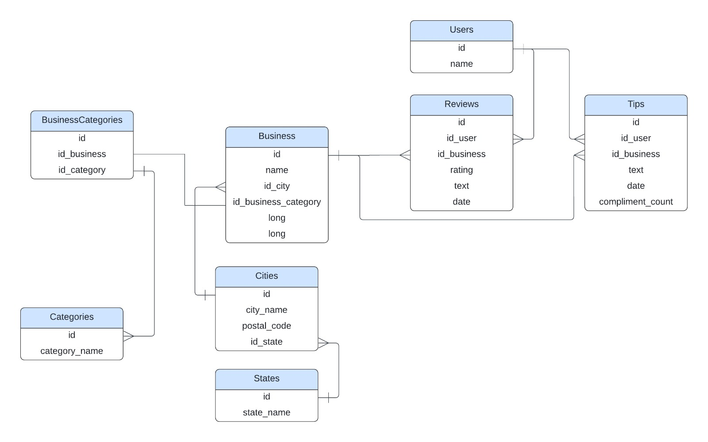

# PROYECTO GRUPAL

## `Data Solutions`

  

## Roles y miembros del equipo
* Data engineer: Alberto - Franky
* Machine learning engineer: Carla - Josue
* Data analyst: Jesús - Jovany

## Introducción
El presente proyecto se centra en el análisis y la creación de sistemas de recomendación basados en reseñas de usuarios de plataformas populares como Google Maps y Yelp. El objetivo principal es desarrollar herramientas que ayuden a un conglomerado de empresas a comprender mejor la percepción de sus clientes y a tomar decisiones informadas. Para este proyecto, hemos creado una empresa ficticia llamada Data Solutions, que se encargará de implementar soluciones de ciencia de datos para invertir con éxito.

## Entendimiento de la situación actual
Se describe la situación actual comunicando el contexto, la problemática y expresando posibles soluciones.

### Contexto
Desde hace muchos años, tanto Yelp como Google Maps permiten a los usuarios escribir reseñas sobre sus experiencias en una variedad de negocios, principalmente en el sector comercial. Estas plataformas han ido ganando aceptación y popularidad a medida que las opiniones de los usuarios han crecido y tomado protagonismo, ayudando a otros usuarios a tomar decisiones más informadas. Como consecuencia, estas reseñas se han convertido en un recurso valioso para las empresas, permitiéndoles entender la percepción de los clientes sobre sus servicios, medir su desempeño, identificar áreas de mejora y planificar estrategias de negocio más efectivas.

### Problemática
A continuación se detallan los distintos desafíos encontrados:
1. Conocimiento del cliente: Las empresas necesitan conocer la imagen que los usuarios tienen de ellas a través de un análisis de las reseñas para mejorar su desempeño, valorar sus opiniones y ofrecer servicios personalizados.
2. Experiencia del usuario: Al usuario se le dificulta la elección del establecimiento adecuado que cumpla con sus preferencias. 
3. Ubicación de locales: Las empresas necesitan identificar las mejores ubicaciones para nuevos locales y así invertir correctamente.
   
### Posibles soluciones
1. Desarrollar un sistema de recomendación utilizando algoritmos de machine learning para analizar las opiniones e identificar patrones de preferencia.
2. Implementar un análisis de sentimiento utilizando técnicas de procesamiento de lenguaje natural (NLP).
3. Combinar los puntos 1 y 2 y desarrollar un sistema híbrido de recomendación, aprovechando las fortalezas de cada uno.

## Objetivos
1. Desarrollar un sistema de recomendación que sugiera nuevos restaurantes que el usuario probablemente disfrutará, basado en calificaciones previas (aunque no las haya visitado antes), o basado en usuario que tienen gustos similares, o que brinde la posibilidad de, mediante un motor de búsqueda, recomendar el restaurante.
2. Implementar un análisis de sentimiento detallado de las opiniones de los usuarios en Yelp y Google Maps para cuantificar la percepción de los clientes y predecir el éxito o fracaso potencial de nuevos locales en distintas ubicaciones.
3. Crear un dashboard interactivo que brinde a los clientes una visualización clara y precisa, destacando las áreas clave en las que deberían enfocar sus esfuerzos para alcanzar los objetivos propuestos.

## Metodología
Para alcanzar dichos objetivos, se utilizará la metodología Scrum, un marco de trabajo ágil diseñado para gestionar proyectos complejos y adaptarse rápidamente a los cambios. El seguimiento se realizará en ciclos cortos llamados Sprints, con entregas incrementales alineadas con las necesidades del negocio y del cliente, distribuidas en tres fases. Para mayor detalle, se anexa un documento llamado 'metodologiaScrum'.

## Alcance
Desplegar un sistema de recomendación e implementar un tablero de control para la toma de decisiones gerenciales, considerando dos factores importantes: el sector gastronómico, por ser una categoría clave, y los 10 estados más relevantes de la zona este en términos de cantidad de reseñas, para asegurar la relevancia de los datos. Estas consideraciones se aplican a este proyecto debido a cuestiones de tiempo y escala, pero podrían expandirse en futuras etapas.

## Stack tecnológico
A continuación, se agrupan las distintas tecnologías según flujo de trabajo:
1. Fuente de datos:
   1. API de Yelp.
   2. API de Google Maps.
   3. Google Drive.
2. Procesamiento de datos:
   1. Apache Spark.
   2. Python.
   3. Pandas.
   4. Google Cloud Big Query.
3. Análisis exploratorio de datos:
   1. NumPy.
   2. Matplotlib y Seaborn.
   3. Plotly.
   4. Scikit-learn.
4. Machine Learning:
   1. Scikit-learn.
   2. TensorFlow o PyTorch.
   3. NLTK y SpaCy.
   4. Pickle.
   5. Huggin Face (BERT).
5. Implementación:
   1. Google Cloud Run.
   2. Google Cloud Build.
6. Visualización:
   1. Power BI.
   2. Looker Studio.

## Indicadores claves de rendimiento (KPIs)
A continuación, se mencionan los KPI que se visualizarán en el Dashboard para facilitar el seguimiento, control y la toma de decisiones estratégicas.
* __`Satisfacción del cliente:`__

**Objetivo:** Aumentar la calificación promedio por establecimiento recomendado en un 10 % para el próximo trimestre.

**Fórmula para calcular el KPI:**

Satisfacción del cliente = Calificación promedio de restaurantes recomendados (trimestre actual) / (Calificación promedio de restaurantes recomendados (trimestre anterior)) * 100

* __`Rendimiento del modelo (acuraccy):`__

**Objetivo:** Incrementar la proporción de recomendaciones correctas en un 10 % para el próximo trimestre.

**Fórmula para calcular el KPI:**

Rendimiento del modelo = (Proporción de recomendaciones correctas (trimestre actual)) / (Proporción de recomendaciones correctas (trimestre anterior)) * 100

**Fórmula para calcular la proporción de recomendaciones correctas:**

Proporción de recomendaciones correctas = (Recomendaciones correctas / Total de recomendaciones) * 100

* __`Fidelización del cliente:`__

**Objetivo:** Incrementar la tasa de clientes recurrentes en un 10 % para el próximo trimestre.

**Fórmula para calcular el KPI:**

Fidelización del cliente  = (Tasa de clientes recurrentes (trimestre actual)) / (Tasa de clientes recurrentes (trimestre anterior)) * 100

**Fórmula para calcular la tasa de clientes recurrentes:**

Tasa de clientes recurrentes = (Clientes recurrentes / Clientes únicos totales) * 100

* __`Tasa de reseñas:`__

**Objetivo:** Aumentar el número de reseñas en un 20 % para el próximo trimestre.

**Fórmula para calcular el KPI:**

Tasa de reseñas = (Número de reseñas (trimestres actual) / Número de reseñas (trimestres anterior)) * 100

## Encuesta de satisfacción
Para llevar a cabo los KPIs enunciados, es necesario que el cliente, después de visitar el establecimiento recomendado, reciba una notificación con las siguientes preguntas:
1. Califique el establecimiento con estrellas del 1 al 5.
2. Evalúe su satisfacción: positiva, neutra o negativa.
3. Indique si es su primera visita o una visita repetida.

## Consideraciones adicionales para los KPIs
Estos KPIs se lograrán con mayor efectividad mediante campañas de marketing para impulsar las reseñas y la participación en la encuesta de satisfacción. Por ejemplo, se podrían incentivar con programas de puntos y recompensas. Sin embargo, por cuestiones de tiempo, se ha decidido aplazarlos para fases futuras del proyecto.

## Cronograma general
A continuación se visualiza un cronograma de Gantt, el cual muestra de manera clara las tareas asignadas por persona y los tiempos de trabajo, vinculándose perfectamente con los hitos clave que deben alcanzarse.

  

## Diagrama de enteridad-relación

  

## Fuente de los datos:
Los datasets provienen de Yelp y Google Maps.
